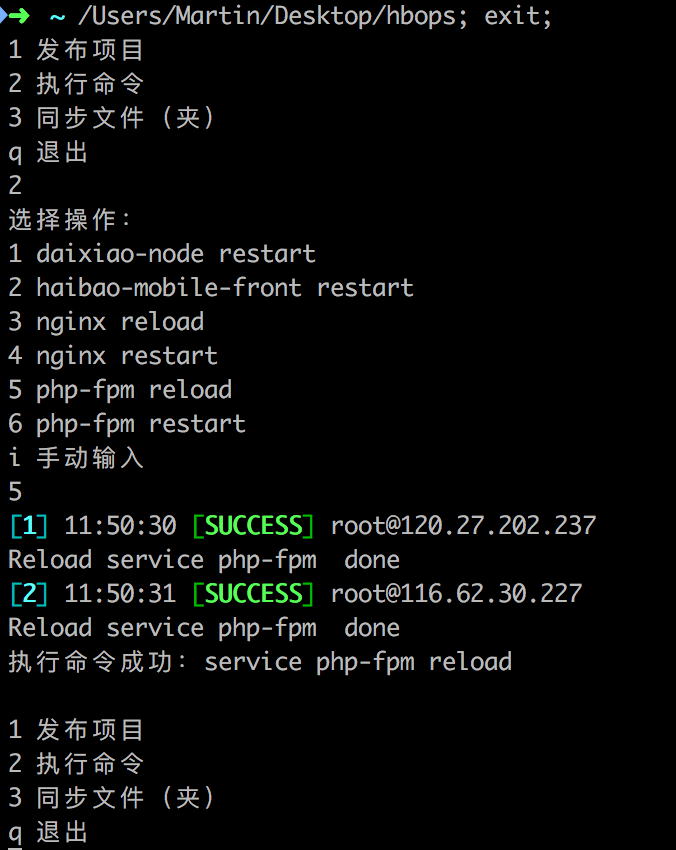

## 简单的服务器运维工具

*[English Edition README](./README-EN.md)*

### 参考
- [简明Python教程](http://www.cuhk.edu.cn/library/dw/tg/il/Python_shen.pdf)
- [pssh手册](https://www.mankier.com/1/pssh)
- [pscp手册](https://www.mankier.com/1/pscp)
- [批量部署自动化之pssh](https://ruiaylin.github.io/2014/11/20/pssh/)

### 简单介绍
- 这是使用Python编写的孩宝服务器运维脚本
- 包括批量代码部署／更新，命令执行，文件（夹）同步
- 推荐IDE：[PyCharm CE](https://www.jetbrains.com/pycharm/download/)

### 使用说明
- 安装pssh：`brew install wget && wget https://storage.googleapis.com/google-code-archive-downloads/v2/code.google.com/parallel-ssh/pssh-2.3.1.tar.gz && tar zxvf pssh-2.3.1.tar.gz && cd pssh-2.3.1 && python setup.py install`
- 本地已经配置好免密码登录要操作的服务器，参考[SSH免密码登录服务器](https://www.digitalocean.com/community/tutorials/how-to-configure-ssh-key-based-authentication-on-a-linux-server)
- 执行`python main.py`

### 配置说明
- 配置文件在config文件夹下
- 在config/config.py中：可增加／修改部署项目；可预设执行命令；可预设同步文件（夹）
- 在config/ssh_hosts.txt中可增加／修改发布代码或执行命令的服务器
- 在config/scp_hosts.txt中可增加／修改同步文件（夹）的服务器

### 执行界面截图

